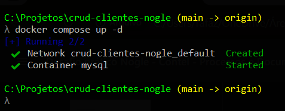
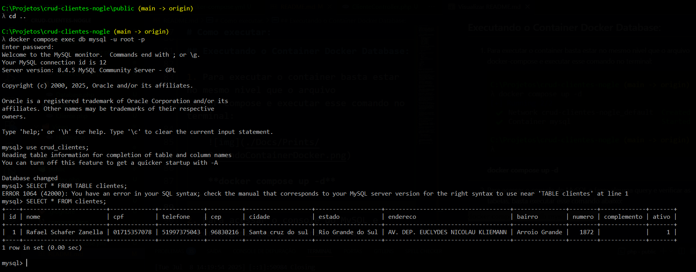
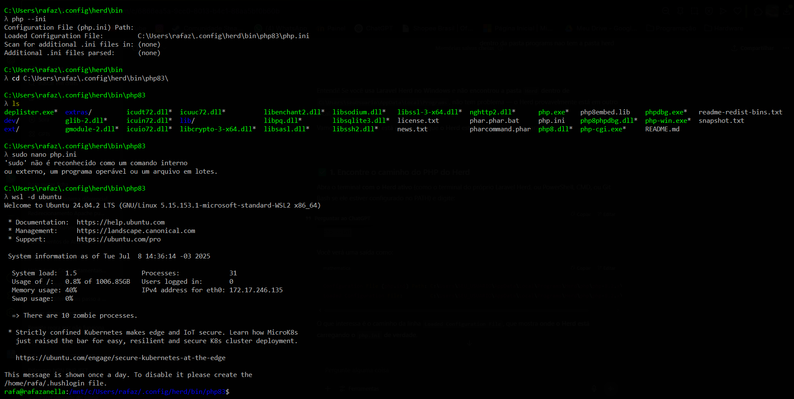
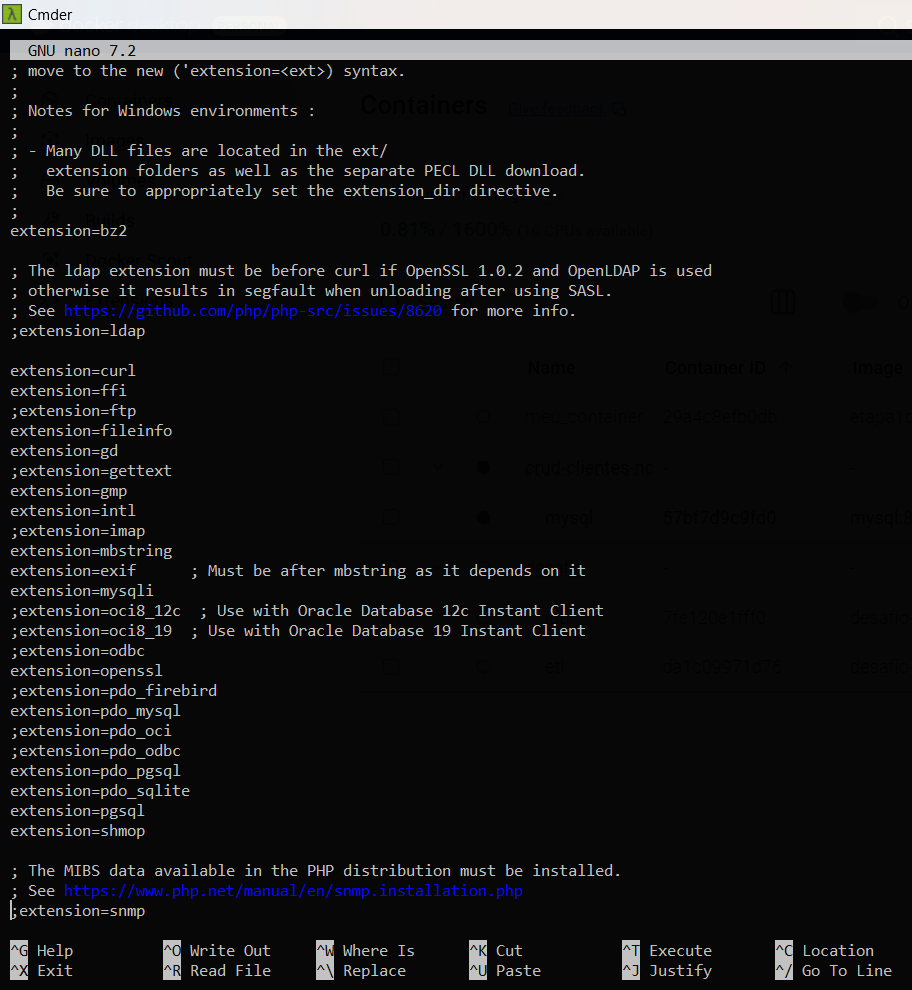

# Desafio Prático Nogle

## Resumo:
O desafio proposto na reunião com o Caio e Lucas foi o seguinte: Desenvolver um CRUD (Create, Read, Update e Delete) de uma lista de clientes em uma linguagem da minha escolha e em apenas uma tela.

## Requisitos Minimos:

1. Possuir um botão de **Novo Cliente** que ao ser clicado abre um modal com os campos abaixo:

    - Nome Cliente: obrigatório
    - CPF: obrigatório
    - Telefone: obrigatório
    - CEP: obrigatório
    - Cidade: obrigatório
    - Estado: obrigatório
    - Endereço: obrigatório
    - Bairro: obrigatório
    - Número: obrigatório
    - Complemento: opcional

    Além desses campos, dentro do modal ter 2 botões. Um chamado **cancelar** e outro para **salvar**

2. Ter dois campos para filtros:

    - Nome Cliente
    - CPF

3. Tabela que lista os clientes com as seguintes colunas:

    - Nome Cliente
    - CPF
    - Telefone
    - Endereço Completo

    Cada linha da tabela Precisa ter 2 botões:

    - Editar
    - Inativar
# Tecnologias:
- PHP 8.3
- Docker + MySQL
- HTML
- JavaScript

# Solução:

Eu decidi fazer o projeto sem nenhum framework, quis usar o padrão MVC.

Criei uma pasta [App/](./App/) que dentro dela estão as outras pastas que fazem parte da minha estrutura.

A pasta [Controllers/](./App/Controllers/) possui o meu unico controller [ClienteController.php](./App/Controllers/ClienteController.php) que é responsável por pegar os dados dos clientes e enviar para a minha DAO que faz o intermedio entre minha aplicação e o banco de dados.

A pasta [DAO/](./App/DAO/) como foi citada acima é responsavel pelas operações com o banco de dados, como criar, inativar um cliente e outras.

A pasta [Database/](./App/Database/) possui meu arquivo de conexão, que serve para minha aplicação se conectar com meu banco de dados.

A pasta [Models/](./App/Models/) guarda a classe que define os atributos do objeto, a classe cliente representa um cliente com seus dados(atributos).

A pasta [Views/](./App/Views/) possui a minha view que é responsável pelos formulários e tabela, ela recebe os dados do controller e envia para o usuário

Fora da pasta App, tem a pasta [public/](./public/) que tem meu arquivo [index.php](./public/index.php) nele eu transformei minha url em umas rotas com nomes mais amigaveis e chamei meus metodos do meu controller

O arquivo [docker-compose.yml](./docker-compose.yml) é responsável pelo container para o meu banco de dados MySQL

Dentro da pasta [init/](./init/) tem o meu script para a criação da tabela **[clientes](./init/cria_tabela.sql)** que é executado automaticamente quando é rodado o docker-compose e cria a tabela dentro do meu banco.

# Como executar:

O meu arquivo [.env](./.env) eu comentei ele no [.gitignore](./.gitignore) para ficar mais fácil a execução, porém não é uma boa pratica deixar as chaves expostas no repositório.

## Instalando Dependências:

É preciso ter o **Composer** instalado para obter as dependências do projeto.

Link para **Download do Composer**: https://getcomposer.org/

Após certificar-se de ter o Composer, execute o seguinte comando no terminal na cadama da raiz do projeto: **composer install**

Isso resultará na pasta **vendor/** com as dependências necessárias.

## Executando o Container Docker Database:

1. Para executar o container basta estar no mesmo nivel que o arquivo docker-compose e executar esse comando no terminal:

    

    **docker compose up -d**
---

2. Para acessar o console do MySQL e fazer alguma query e verificar as tabelas, basta executar esse comando abaixo:

    **docker compose exec db mysql -u root -p**

    Após executar basta usar a senha cadastrada no ambiente e fazer a query

    

## Utilizando o **pdo_mysql** do PHP:

Para funcionar a conexão entre o banco e o PHP é preciso descomentar uma linha do seu arquivo de configuração.

Como encontrar o **php.ini**

Após encontrar basta editar e descomentar a linha que possui **;extension=pdo_mysql**, é só tirar o **;** na frente e salvar o arquivo.

## Executar o PHP Localmente:

Basta acessar a pasta [public/](./public/) usando o comando **cd public** na raiz no terminal e executar o PHP localmente com o comando:

**php -S localhost:8080**

**Lembrando que esse comando deve ser executado dentro da pasta public, que é onde está o meu index.php**

Após isso é só acessar a url **http://localhost:8080**